# Omarchy 01 Theme

A high-contrast EVA Unit 01 palette with deep violet shadows, neon lime accents, and soft lilac highlights for a dramatic, sci-fi cockpit feel.

## Preview

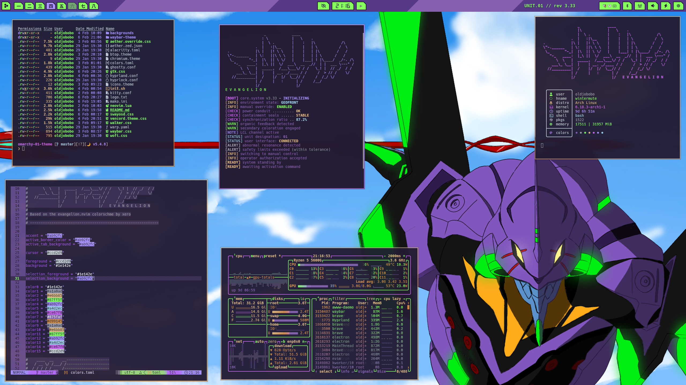

## Install

Use the Omarchy theme installer:

```bash
omarchy-theme-install https://github.com/OldJobobo/omarchy-01-theme
```

## Wallpapers

| | | |
| --- | --- | --- |
|  |  |  |
| 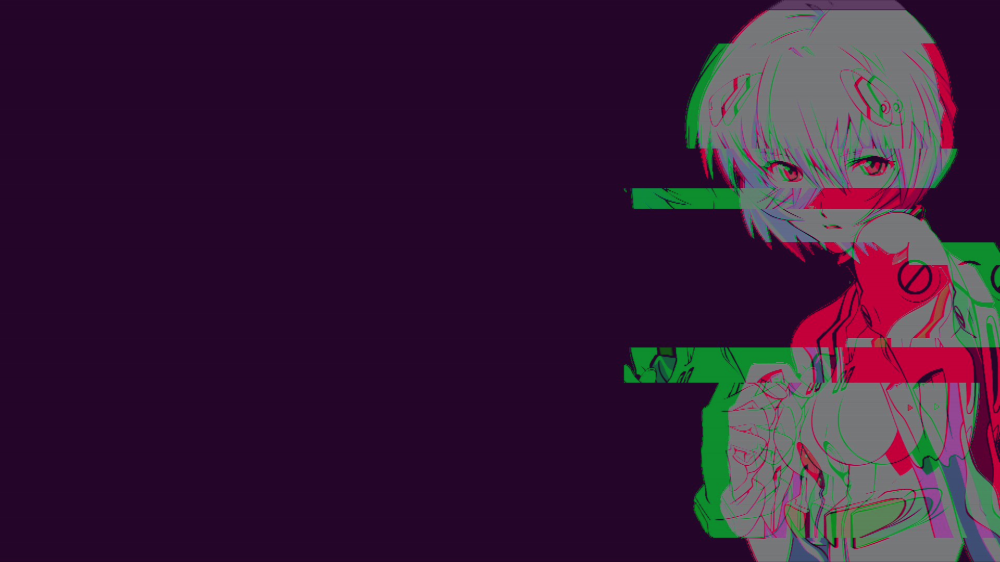 | 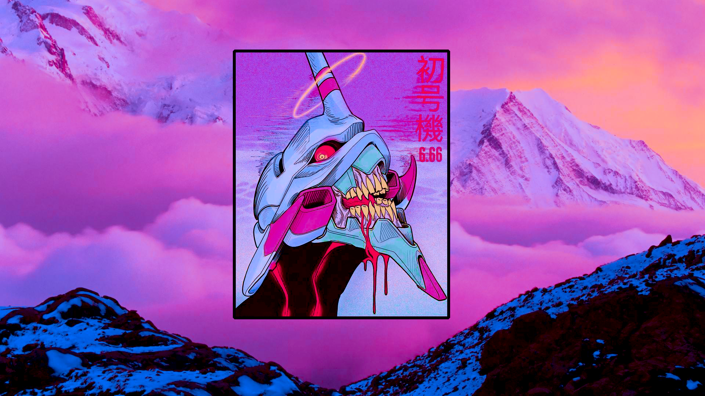 |  |
| 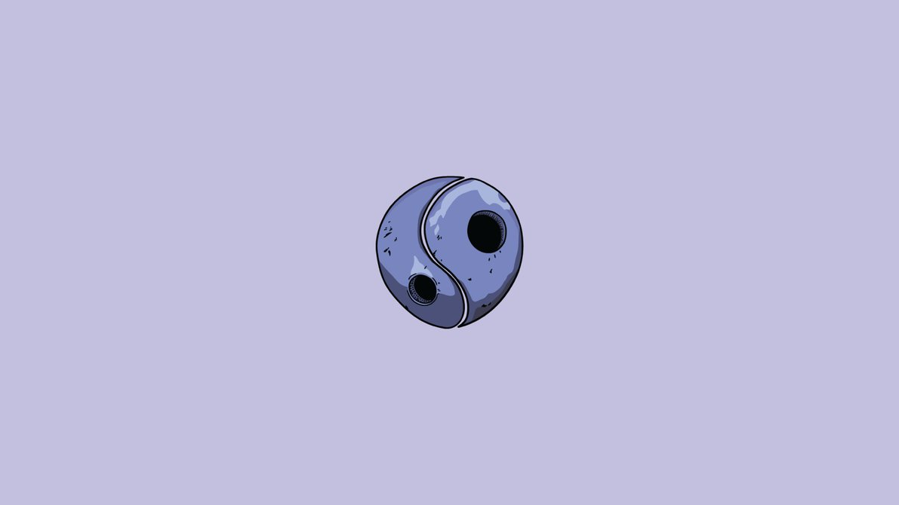 | 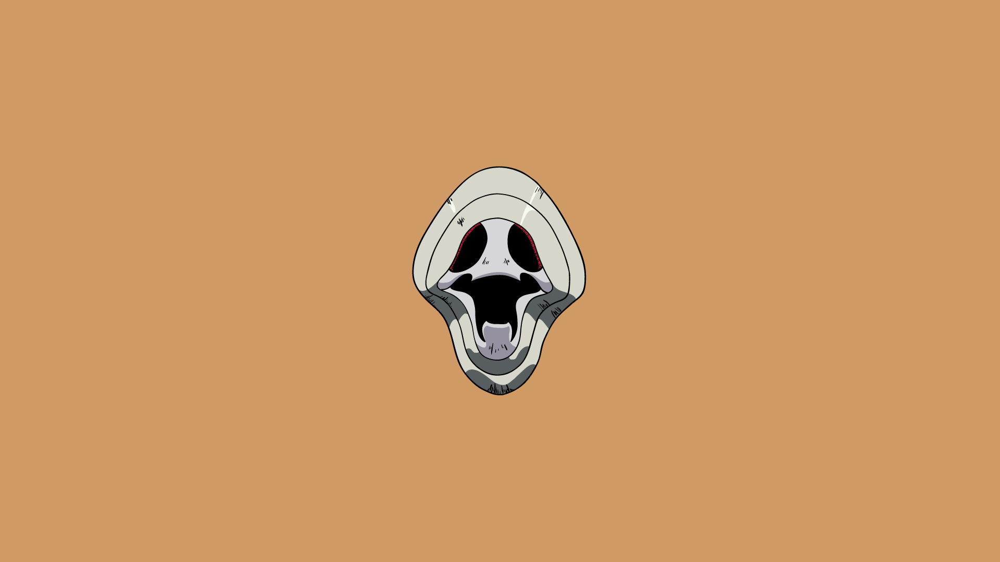 |  |
|  | 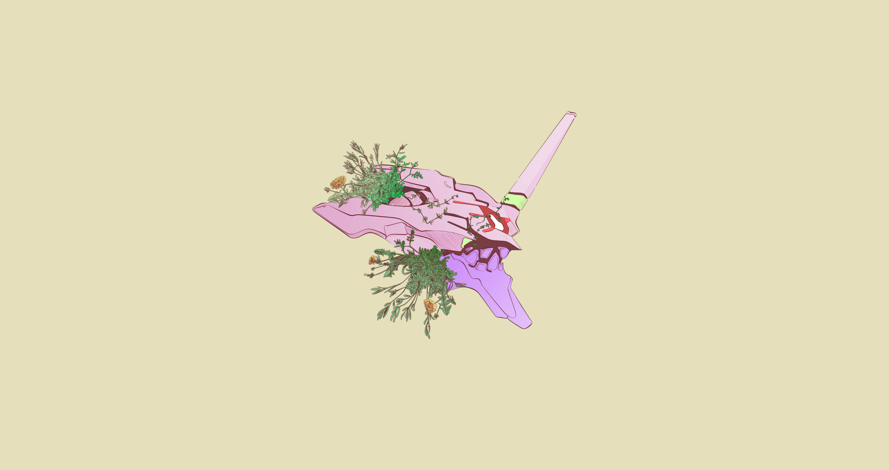 | 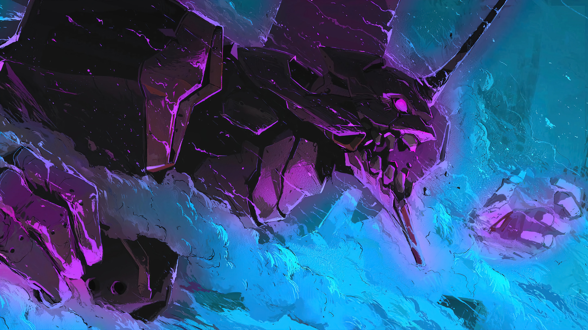 |
| 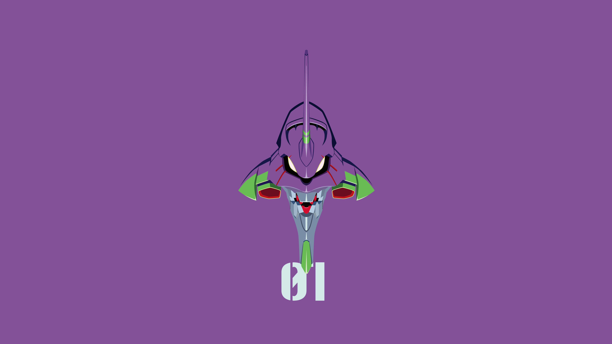 | 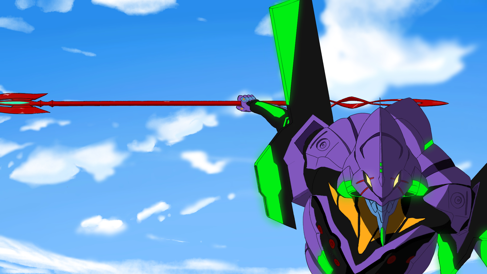 |  |
| 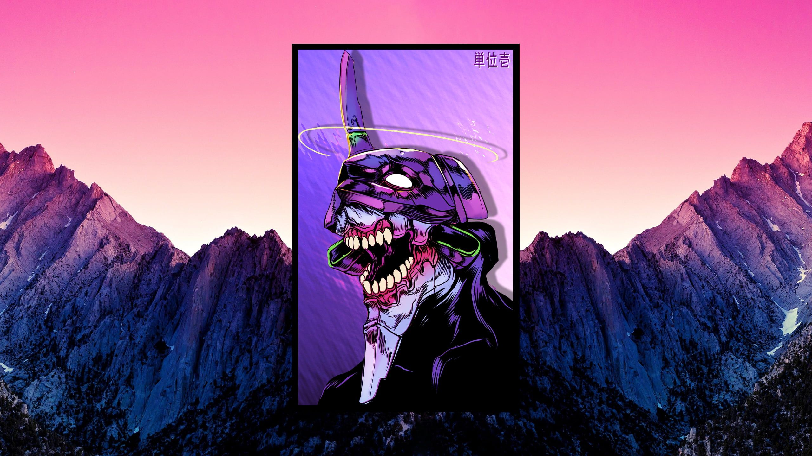 |  | 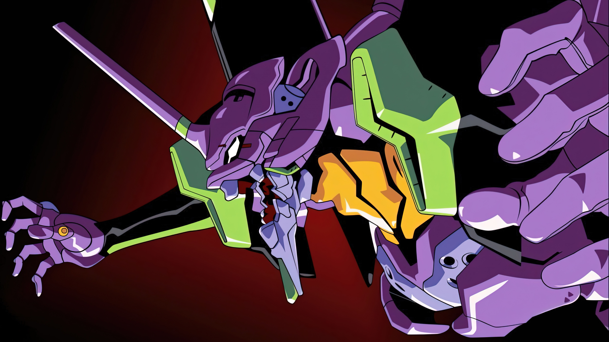 |
| 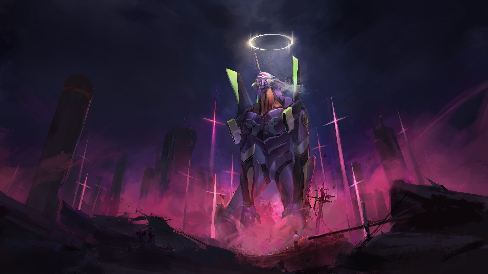 |  |  |

## Requirements

- `Yaru-purple` icon theme

## Attribution

- Palette inspired by the evangelion.nvim colorscheme by xero.style 
